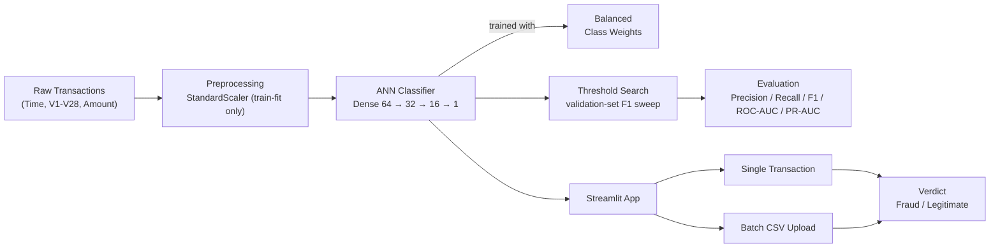

<div align="center">

# Argus

**Intelligent Credit Card Fraud Detection System**

Score a transaction and know in seconds whether it's legitimate or fraudulent — powered by a class-weighted neural network trained to survive a dataset where fraud is just 0.17% of all traffic.

[](https://python.org)
[](https://tensorflow.org)
[](https://keras.io)
[](https://scikit-learn.org)
[](https://streamlit.io)
[](https://pytest.org)

</div>

---

## Features

| Feature | Description |
|---|---|
| **Class-Weighted ANN** | Dense neural network trained with balanced class weights instead of resampling, to handle the ~1:580 fraud imbalance |
| **Threshold Tuning** | Decision threshold selected by scanning validation-set F1 across candidates — not a hardcoded 0.5 |
| **Imbalance-Aware Evaluation** | Reports precision, recall, F1, ROC-AUC, and PR-AUC — not accuracy, which is meaningless on this dataset |
| **Single-Transaction Scoring** | Fill in transaction fields (or load a one-click legitimate/suspicious example) and get a live fraud probability |
| **Batch CSV Scoring** | Upload a CSV of transactions and download scored results |
| **Live Metrics Sidebar** | Dashboard shows real test-set model performance pulled straight from the evaluation run |
| **Reproducible Pipeline** | Every step — split, train, threshold search, evaluate — runs from the CLI and regenerates the checked-in artifacts |

---

## Architecture



---

## Tech Stack

- **Modeling**: [TensorFlow / Keras](https://tensorflow.org) — class-weighted dense classifier
- **Preprocessing**: [scikit-learn](https://scikit-learn.org) — `StandardScaler`, stratified splitting, class-weight computation
- **Data**: [pandas](https://pandas.pydata.org) + [NumPy](https://numpy.org)
- **App**: [Streamlit](https://streamlit.io) — single-transaction and batch scoring dashboard
- **Testing / Tooling**: [pytest](https://pytest.org) + [ruff](https://docs.astral.sh/ruff/)

---

## Quick Start

### Prerequisites

- Python ≥ 3.10
- The [Credit Card Fraud Detection dataset](https://www.kaggle.com/datasets/mlg-ulb/creditcardfraud) (Kaggle / ULB Machine Learning Group), only needed if you want to retrain — a trained model is already checked into `models/`

### Installation

```bash
# Clone the repository
git clone https://github.com/YOUR_USERNAME/Argus.git
cd Argus

# Create virtual environment
python -m venv .venv
source .venv/bin/activate   # macOS/Linux
# .venv\Scripts\activate    # Windows

# Install dependencies
pip install -e ".[dev]"
```

### Run

```bash
streamlit run app/app.py
```

The app opens at **http://localhost:8501**.

### Reproduce training (optional)

Place the dataset at `data/raw/creditcard.csv` (gitignored, not committed), then:

```bash
python -m fraud_detection.train      # trains the model, saves models/*.keras + scaler.pkl
python -m fraud_detection.evaluate   # scores the test set, saves results/ + images/
```

---

## Project Structure

```
Argus/
├── app/
│   └── app.py                   # Streamlit dashboard (main entry point)
├── src/fraud_detection/
│   ├── config.py                 # paths, feature schema, constants
│   ├── data.py                   # load_dataset / split_data
│   ├── model.py                  # network architecture, class weights
│   ├── train.py                  # training entry point (CLI)
│   ├── evaluate.py               # evaluation + threshold search (CLI)
│   └── predict.py                # inference (single + batch)
├── notebooks/                    # EDA, preprocessing, training, evaluation walkthroughs
├── tests/                        # pytest unit tests
├── models/                       # saved model + scaler artifacts
├── results/                      # evaluation_metrics.csv
├── images/                       # ROC / PR curve plots
├── pyproject.toml
└── requirements.txt
```

---

## Usage

1. Launch the app with `streamlit run app/app.py`
2. On the **Single Transaction** tab, load a one-click legitimate/suspicious example, or fill in `Time`, `Amount`, and `V1`–`V28`
3. Click **Predict Transaction** — see the fraud probability and verdict card
4. On the **Batch Upload** tab, upload a CSV of transactions to score them all at once and download the results
5. Check the sidebar for the model's live test-set performance (precision, recall, F1, ROC-AUC, PR-AUC)

---

## Results

Test-set performance at the F1-optimal threshold:

| Threshold | Precision | Recall | F1-Score | ROC-AUC | PR-AUC |
|---|---|---|---|---|---|
| 0.99 | 0.796 | 0.779 | 0.787 | 0.959 | 0.687 |

PR-AUC is the more informative metric here — under this severity of class imbalance, ROC-AUC can look deceptively strong even when precision at usable recall levels is much lower.

---

## Tests

```bash
pytest
```

Unit tests cover the stratified data-splitting logic and the prediction/batch-prediction interface, with the model and scaler mocked so they run without a full TensorFlow install or the real dataset.

---

## Limitations & Roadmap

- The 28 PCA features are anonymized, so the model can't be interpreted in terms of real transaction attributes (merchant, location, etc.)
- No temporal validation — a production system would need to account for fraud patterns drifting over time, which a single random train/test split doesn't capture
- Worth comparing against gradient-boosted trees (XGBoost / LightGBM) and adding SHAP-based explainability

---

## License

This project is distributed under the [MIT License](LICENSE).

---

<div align="center">
<sub>Built with TensorFlow, scikit-learn & Streamlit</sub>
</div>
