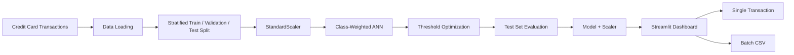

<div align="center">

# Argus

**Intelligent Credit Card Fraud Detection System**

Detect fraudulent credit card transactions using a class-weighted neural network, optimized decision thresholds, and an interactive Streamlit dashboard.


\

</div>

---

## Overview

**Argus** is an intelligent credit card fraud detection system designed to identify potentially fraudulent transactions from highly imbalanced transaction data.

Fraud detection presents a major class-imbalance challenge. In the dataset used by Argus, fraudulent transactions represent only about **0.17%** of all transactions. A model that predicts every transaction as legitimate could therefore achieve extremely high accuracy while completely failing to detect fraud.

Argus addresses this problem by focusing on metrics that are more informative for rare-event detection and by optimizing the classification threshold using validation-set F1 score.

The system:

* Trains a class-weighted artificial neural network
* Uses stratified train, validation, and test splits
* Applies `StandardScaler` using only training data
* Optimizes the fraud decision threshold using validation F1
* Evaluates precision, recall, F1-score, ROC-AUC, and PR-AUC
* Supports single-transaction prediction
* Supports batch CSV transaction scoring
* Provides an interactive Streamlit dashboard

---

## Features

| Feature                      | Description                                                 |
| ---------------------------- | ----------------------------------------------------------- |
| **Fraud Detection**          | Neural network for binary fraud classification              |
| **Class Imbalance Handling** | Uses balanced class weights without resampling              |
| **Threshold Optimization**   | Searches for the threshold producing the best validation F1 |
| **Fraud Probability**        | Returns a probability score for each transaction            |
| **Single Prediction**        | Score individual transactions through the dashboard         |
| **Batch Prediction**         | Upload a CSV and score multiple transactions                |
| **Model Evaluation**         | Precision, recall, F1, ROC-AUC, and PR-AUC                  |
| **Interactive Dashboard**    | Streamlit interface for model predictions and metrics       |
| **Automated Testing**        | Pytest tests for data and prediction components             |

---

## Architecture



---

## Modeling Pipeline

```text
Raw Transactions
        │
        ▼
Data Preprocessing
        │
        ├── Stratified Train / Validation / Test Split
        │
        ▼
StandardScaler
        │
        ▼
Class-Weighted Neural Network
        │
        ▼
Validation Threshold Search
        │
        ▼
Optimal F1 Threshold
        │
        ▼
Untouched Test Set
        │
        ▼
Precision / Recall / F1 / ROC-AUC / PR-AUC
```

### Neural Network

```text
Input (30)
    │
    ▼
Dense(64, ReLU)
    │
    ▼
Dropout(0.3)
    │
    ▼
Dense(32, ReLU)
    │
    ▼
Dropout(0.3)
    │
    ▼
Dense(16, ReLU)
    │
    ▼
Dense(1, Sigmoid)
```

The network uses class weights during training to account for the severe imbalance between legitimate and fraudulent transactions.

---

## Results

Test-set performance at the F1-optimal decision threshold:

| Threshold | Precision |    Recall |  F1-Score |   ROC-AUC |    PR-AUC |
| --------- | --------: | --------: | --------: | --------: | --------: |
| **0.99**  | **0.796** | **0.779** | **0.787** | **0.959** | **0.687** |

Because fraud is extremely rare, **PR-AUC** provides useful information about the model's precision-recall behavior under class imbalance, alongside ROC-AUC and threshold-specific metrics.

---

## Interactive Dashboard

Argus includes a Streamlit dashboard for interacting with the trained model.

### Single Transaction

* Enter or select transaction features
* Generate a fraud probability
* Compare the probability against the optimized threshold
* Display a legitimate or suspicious verdict

### Batch Prediction

* Upload a CSV containing transactions
* Process multiple transactions
* Generate fraud probabilities
* Export prediction results

### Model Metrics

The dashboard also provides access to the model's evaluation metrics, including:

* Precision
* Recall
* F1-score
* ROC-AUC
* PR-AUC

---

## Project Structure

```text
Argus/
│
├── app/
│   └── app.py
│
├── src/
│   └── fraud_detection/
│       ├── __init__.py
│       ├── config.py
│       ├── data.py
│       ├── model.py
│       ├── train.py
│       ├── evaluate.py
│       └── predict.py
│
├── notebooks/
│   └── ...
│
├── tests/
│   ├── conftest.py
│   ├── test_data.py
│   └── test_predict.py
│
├── data/
│   └── raw/
│       └── creditcard.csv
│
├── models/
│   └── ...
│
├── results/
│   └── ...
│
├── images/
│   └── ...
│
├── pyproject.toml
├── requirements.txt
├── requirements-dev.txt
├── .gitignore
└── README.md
```

---

## Quick Start

### Prerequisites

* Python ≥ 3.10
* pip
* Git

### Clone the Repository

```bash
git clone https://github.com/MaddipatlaChetan24/Argus-Intelligent-Credit-Card-Fraud-Detection-System.git

cd Argus-Intelligent-Credit-Card-Fraud-Detection-System
```

### Create a Virtual Environment

**macOS / Linux**

```bash
python3 -m venv .venv
source .venv/bin/activate
```

**Windows**

```powershell
python -m venv .venv
.venv\Scripts\activate
```

### Install Dependencies

```bash
pip install -r requirements.txt
```

For development and testing:

```bash
pip install -r requirements-dev.txt
```

---

## Dataset

Argus uses the **Credit Card Fraud Detection** dataset from Kaggle and the ULB Machine Learning Group.

The dataset contains **284,807 transactions**, including `Time`, `Amount`, 28 anonymized PCA-transformed features (`V1`–`V28`), and the binary `Class` target.

* `Class = 0` → Legitimate transaction
* `Class = 1` → Fraudulent transaction

Download the dataset and place it at:

```text
data/raw/creditcard.csv
```

The dataset is excluded from version control through `.gitignore`.

---

## Running the Project

### Train the Model

```bash
python -m fraud_detection.train
```

This trains the neural network and saves the required model and scaler artifacts.

### Evaluate the Model

```bash
python -m fraud_detection.evaluate
```

This evaluates the model on the test set and generates evaluation results.

### Launch the Dashboard

```bash
streamlit run app/app.py
```

The application will be available at:

```text
http://localhost:8501
```

### Run Tests

```bash
pytest
```

The test suite covers data splitting and prediction functionality. Model and scaler components can be mocked so that the tests can run without requiring the complete training environment or dataset.

---

## Technology Stack

### Machine Learning

* **TensorFlow**
* **Keras**
* **scikit-learn**

### Data Processing

* **pandas**
* **NumPy**

### Application

* **Streamlit**

### Testing & Development

* **pytest**
* **ruff**

---

## Limitations

* The dataset's 28 PCA-transformed features are anonymized, limiting direct interpretation of individual transaction characteristics.
* The current evaluation uses a random stratified split rather than temporal validation.
* Real-world fraud patterns can change over time, requiring continuous monitoring and model updates.
* Model performance on this dataset may not directly represent performance on live financial transaction data.

---

## Roadmap

* [ ] Compare against XGBoost and LightGBM
* [ ] Add SHAP-based prediction explanations
* [ ] Implement temporal / rolling-window validation
* [ ] Add Docker deployment
* [ ] Build a REST API for inference
* [ ] Add model monitoring and drift detection
* [ ] Add configurable alert thresholds
* [ ] Expand batch-processing capabilities

---

## Contributing

Contributions are welcome.

```bash
git checkout -b feature/new-feature

git add .

git commit -m "Add new feature"

git push origin feature/new-feature
```

Then open a Pull Request.

---

## License

This project is distributed under the **MIT License**.

---

<div align="center">

**Argus — Intelligent Credit Card Fraud Detection System**

Built with Python, TensorFlow, Keras, scikit-learn and Streamlit.

</div>
